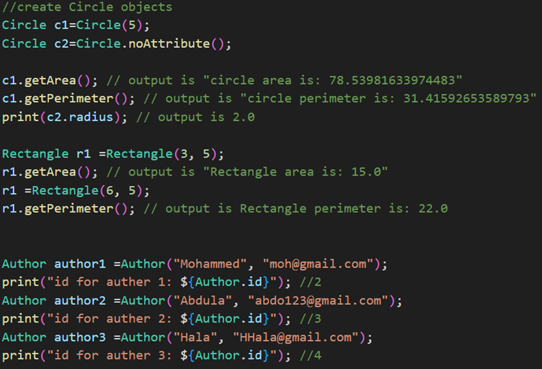

## Shape and Book Management Application

This simple application demonstrates object-oriented programming concepts through two exercises:

### Exercise 1: Shape Calculations

* **Abstract Class `Shape`:** Defines the common interface for shapes, including methods to calculate `getArea()` and `getPerimeter()`.
* **Class `Circle`:** Extends `Shape` and implements the area and perimeter calculations for circles. It takes a `radius` as input.
* **Class `Rectangle`:** Extends `Shape` and implements the area and perimeter calculations for rectangles. It takes `length` and `width` as input.

### Exercise 2: Book and Customer Management

* **Parent Class `Person`:** Defines common attributes for individuals, including `name` and `email`.
* **Class `Author`:** Extends `Person` and represents an author of a book.
* **Class `Customer`:** Extends `Person` and represents a customer who purchases books. It includes a list of `Book` objects to store the customer's purchased books.
* **Class `Book`:** Represents a book with attributes like `name`, `ISBN`, `editionNumber`, and an `Author` object.

### Functionality:

The application allows you to:

* Create `Circle` and `Rectangle` objects with specific dimensions.
* Calculate and display the area and perimeter of each shape.
* Create `Customer` and `Author` objects with their respective details.
* Create `Book` objects with details and assign them to an `Author`.
* Add `Book` objects to a `Customer`'s list of purchased books.
* Print the information of a `Customer`, including their name, email, and the details of the books they have purchased.

### Code Structure:

The code is organized into separate classes for each entity, demonstrating inheritance and polymorphism. You can find the implementation in the source code files.

### Running the Application:

1. Compile the code using a Dart compiler.
2. Run the compiled application.

### Example Usage:

This application provides a simple example of how to use classes, inheritance, and polymorphism to model real-world entities and their relationships. 