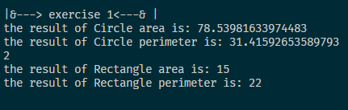
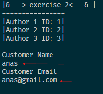

# BookStore

### How to run and test the Project?

#### ~~Exercise 1
<ol>
<li>will get the Circle result of the area calculation
<li>result of the perimeter calculationa
</ol>

#### ~~Exercise 2
<ol>
<li>we need to write the name of Customer and Email
<li>result of purchased book
</ol>

