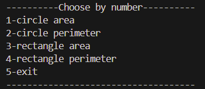

# Assignment-7
## Overview
This project demonstrates fundamental concepts of object-oriented programming in Dart through two exercises: one focusing on geometric shapes and the other on a simple library system.

## Installation

1. Ensure you have Dart installed on your system. If not, you can download it from [Dart's official website](https://dart.dev/get-dart).
2. Clone this repository:
    ```bash
    git clone https://github.com/turki-aloufi/Assignment-7.git
    ```
3. Navigate to the project directory:
    ```bash
    cd assignment-7-oop
    ```

## Usage

1. Run the application:
    ```bash
    dart run
    ```
2. Follow the on-screen instructions to interact with the CLI.

## Exercise 1: Geometric Shapes
This exercise demonstrates basic OOP principles by creating and manipulating geometric shapes (Circle and Rectangle).

### Classes
- **Shape**: Represent an abstract class with two abstract methods;
- **Circle**: Represents a circle with methods to calculate area and perimeter (extends class Shape).
- **Rectangle**: Represents a rectangle with methods to calculate area and perimeter (extends class Shape).

### Usage
1. **Shape**:
  - `getArea()`: Abstract method.
  - `getPerimeter()`: Abstract method.
2. **Circle**:
   - `Circle(double radius)`: Constructor with radius.
   - `Circle.noAttribute()`: Default constructor.
   - `getArea()`: Calculates and prints the area.
   - `getPerimeter()`: Calculates and prints the perimeter.
   - `getRadius`: Gets the current radius.
   - `setRadius`: Sets a new radius.
3. **Rectangle**:
   - `Rectangle({required double length, required double width})`: Constructor with length and width.
   - `Rectangle.noAttribute()`: Default constructor.
   - `getArea()`: Calculates and prints the area.
   - `getPerimeter()`: Calculates and prints the perimeter.
   - `setLength`: Sets a new length.
   - `setWidth`: Sets a new width.

## Exercise 2: Library System
This exercise showcases a basic library system, including authors, books, and customers.

### Classes
- **Person**: Represents a person with a name and email
- **Author**: Inherits from `Person` and includes a unique identifier.
- **Book**: Represents a book with a name, ISBN, edition number, and an author.
- **Customer**: Inherits from `Person` and manages a list of borrowed books.


### Usage
1. **Person**: 
   - `Person({required String name, required String email})`: Constructor with name and email.
2. **Author**:
   - `Author({required String name, required String email})`: Constructor with name and email.
   - `id`: Unique identifier for the author.
3. **Book**:
   - `Book({required String name, required String isbn, required int editionNumber, required Author author})`: Constructor with book details and author.
4. **Customer**:
   - `Customer({required String name, required String email})`: Constructor with name and email.
   - `addBook(Book book)`: Adds a book to the customer's borrowed list.
   - `printInformation()`: Prints the customer's information and their borrowed books.

## Usage Instructions
1. Run the program to see the default examples for both exercises.
2. Follow the prompts to interact with the geometric shapes:
   - Choose an option to calculate area or perimeter for circles and rectangles.

      
   
   - Input new dimensions as needed.
