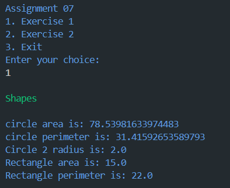
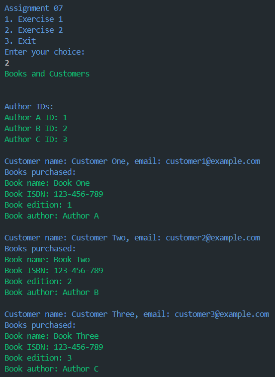

# Dart OOP Exercises

## Exercise 1: Shapes

This exercise demonstrates the use of abstract classes, inheritance, and method overriding in Dart.

### How to Run
1. Ensure you have Dart installed on your system, by using:
```sh
dart --version
```
2. Open a terminal and navigate to the directory containing `assignment07.dart`.
3. Run the file using the command:
```sh
dart run 
```


### Description
- **Shape**: Abstract class with methods `getArea` and `getPerimeter`.
- **Circle**: Extends Shape, includes radius, area, and perimeter calculations.
- **Rectangle**: Extends Shape, includes length, width, area, and perimeter calculations.

### Sample Output



## Exercise 2: Books and Customers

This exercise demonstrates the use of classes, inheritance, and object relationships in Dart.

### How to Run
1. Ensure you have Dart installed on your system.
2. Open a terminal and navigate to the directory containing `exercise2.dart`.
3. Run the file using the command:


### Description
- **Person**: Base class with attributes `name` and `email`.
- **Author**: Extends Person, includes a unique `id`.
- **Book**: Contains book details and an Author object.
- **Customer**: Extends Person, maintains a list of purchased books.

### Sample Output



## Notes
- Follow the provided instructions closely for each exercise.
- For any issues or queries, feel free to reach out.

