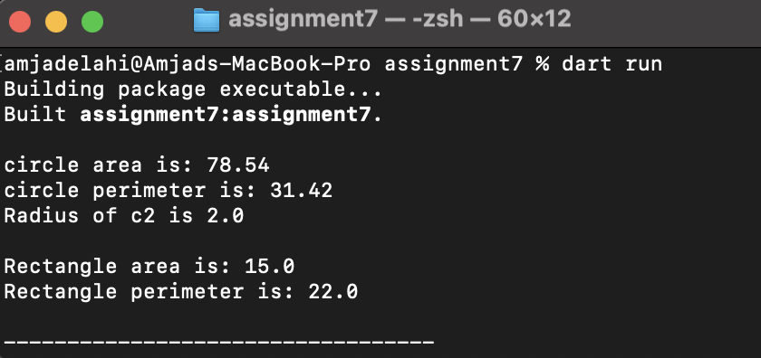
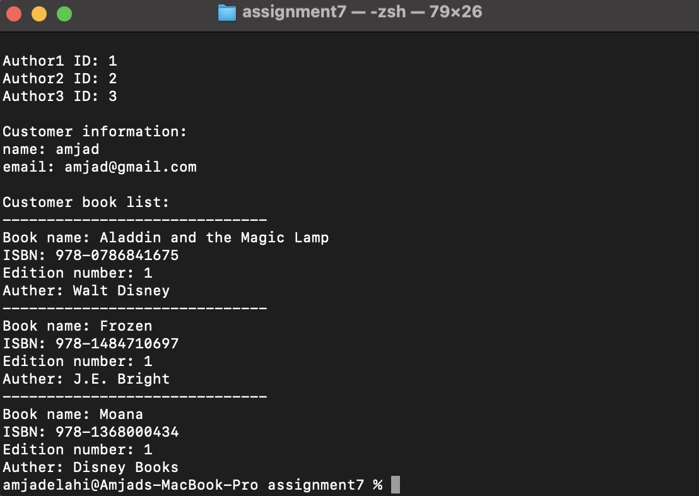
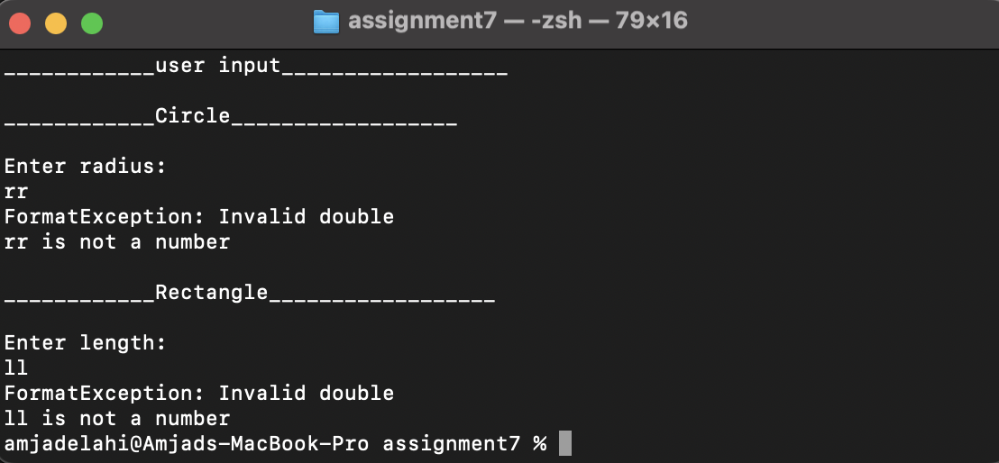

<p align="center">

<br/>

# OOP Exercises

## Description

 Working with object-oriented programming (OOP) concepts by creating classes and using error handling

## Requirements

 In order to run the application, this project requires a Dart SDK and a command line interface (CML).

## install dart SDK
 install dart SDK from [dart documentation](https://dart.dev/get-dart)

## How to run the project

1. Open terminal or CMD.
2. Navigate to the project path, such as 
```bash
cd /Users/amjadelahi/dart-bootCamp/Assignment-7/assignment7

```
 3. Run the application with a command: 
```bash
dart run
```
 4. The output of exrcise 1 is:
      
<p align="center">

<br/>

5. The output of exrcise 2 is:

<p align="center">

<br/>
 
 5. The output of handelling user input is:

 <p align="center">

<br/>

## Supervised by
Engineer. Fahad Alazmi
