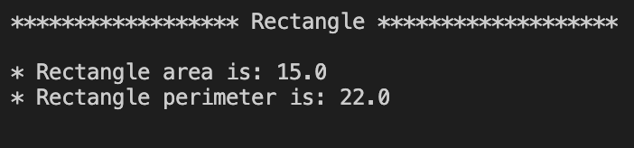
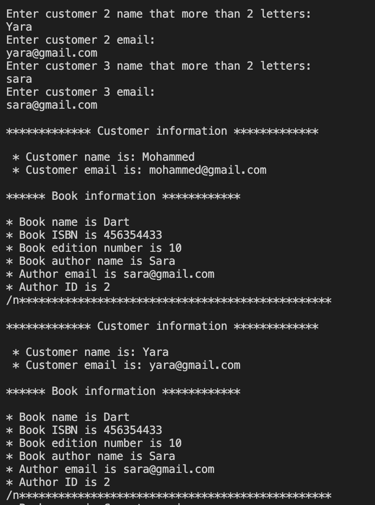

<div style="display: flex; justify-content: space-between; align-items: center;">
  
  
</div>

# OOP in Dart project

## introduction
 This project covers various Dart OOP concepts including different types of constructors (such as parameterized and named constructors). encapsulation, including manage private variables with getters and setters. Additionally, it covers inheritance and the use of `super`, polymorphism, static variables, as well as abstract classes and methods. Lastly, it handle errors using `try`, `catch`, and `throw` statements.

 ## Getting started
In terminal write: 
 ``` 
 dart run
 ```
 now the program has been started.

## How dose it work?
 This project consists of two parts. The first part focuses on calculating the area and perimeter of `Rectangle` and `Circle`.When the program starts, it calculates the area and perimeter based on a `radius` of 2 using these formulas: 
  ```
 area = π * radius^2 
 perimeter = 2 * π * radius.
 ```
 
  The output will be: 

  <p align="center">
  

 Next, the program will calculate the area and perimeter of a `Rectangle` based on a `length` of 3 and a `width` of 5 for the area, and a `width` of 8 for the perimeter. The formulas used will be:
```
area = length * width
 perimeter = 2 * (length + width)
 ```

The output will be: 

<p align="center">
  

The second part of the project will involve gathering detailed information about the `author`, their `books`, and the `customers`. It will then present customer details such as their `name` and `email` address. Additionally, it will provide full details about the `books`, including the `book name`, `ISBN`, `edition number`, `author’s name`, `author’s email`, and `author ID`.

simple example about Author ID: 
<p align="center">
  

To use `try`, `catch`, and `throw`, the user can add more two customers, but note that the customer name must contain at least two letters; otherwise, an exception will be thrown and catch with an error message as shown:
<p align="center">
  

 Additionally, the email must not be null and include an @ sign; if it doesn't, an exception will be thrown and catch with an error message as shown:

<p align="center">
  

  Exaple of correct output:
  <p align="center">
  


 ## Bulid with 
 Dart languge
 
