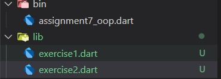
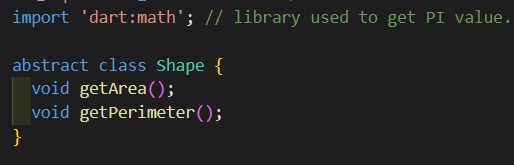
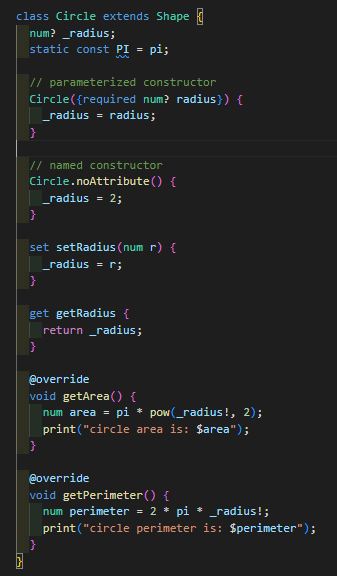
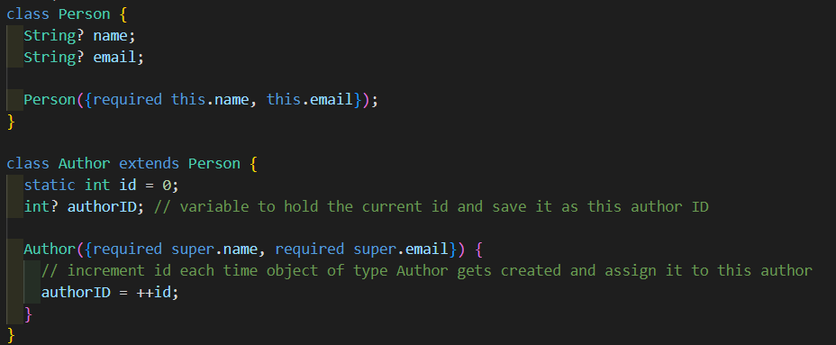
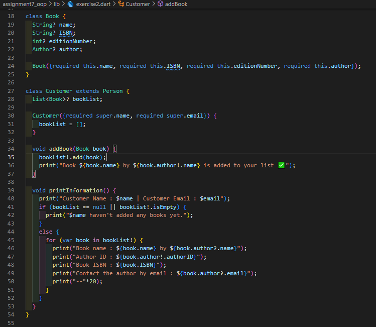
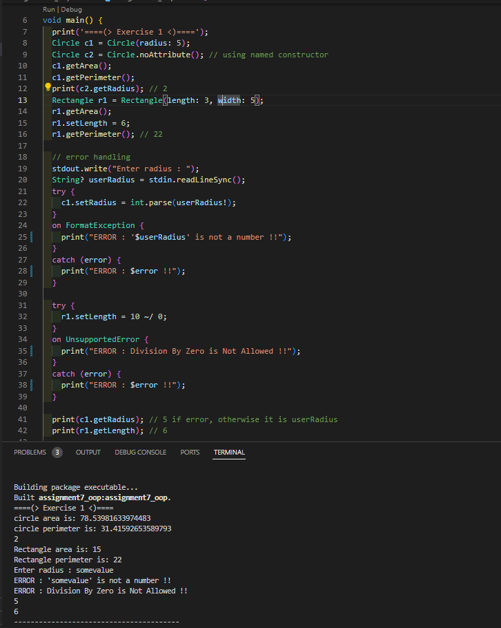
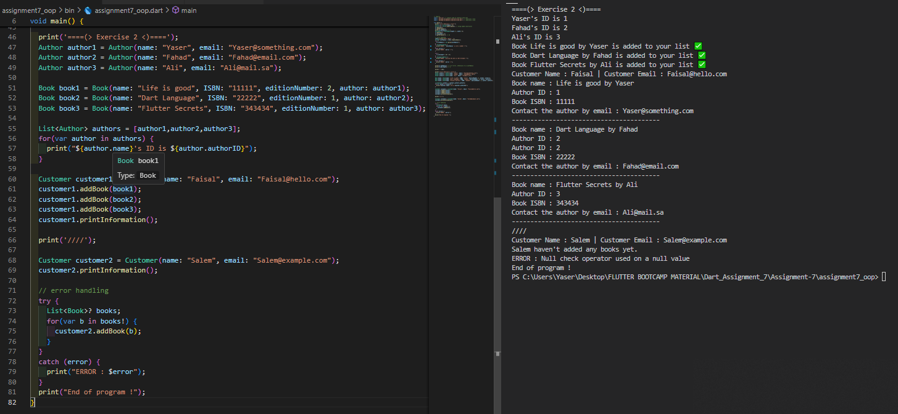

# Assignment 7 : Object Oriented Programming "OOP"

# 1. Overview 📖
This assignment will cover many topics in Object Oriented Programming (OOP) and its applications which includes inheritance, encapsulation, etc..

# 2. Requirements ❓
The assignment is divided into two exercises, each exercise is about building classes in a specific way and deal with it by calling creating instances and calling their functions.

# 3. Code and Implementation 💻
In this section, I will dive into the details of each exercise.

## 3.1 Exercise 1
This exercise was about creating an abstract class `Shape` with two methods to calculate area and perimeter. Those methods are not built yet and will be overridden by classes `Circle` and `Rectangle`.

 

`Circle` and `Rectangle` will inherit all attributes and methods from their parent `Shape`. Naturally, each one will have its own logic and implementation in the inherited methods since both differ in area and perimeter calculations. So, they both **override** the parent method and provide their own calculations.

Also, both classes have **private** variables. We can define **private** variables in dart by naming the variable starting with an `underscore ( _ )`. Those private variables can't be accessed outside the class they were created in unless when using **setters and getters** which basically updates or returns the **private** variable. This process is generally called **encapsulation**.

When creating an object of a class, its **constructor** is called first. The constructor role is to assign initial values to the class variables when creating an object of that variable. In both `Circle` and `Rectangle` classes we have two types of constructors :
- **Parameterized Constructor** : gets called when specifing a certain parameter or set of parameters.
- **Named Constructor** : gets called when specifing another certain parameter or set of parameters.
Parameterized and named constructor are helpful when we want to create multiple instances of the same object using different parameters.

## 3.2 Exercise 2
This exercise doesn't differ much from the previous one except it is using a real-life implementation of classes, where a normal `Person` gets into the bookstore and become a `Customer`, he reads some `Book` of his favorite `Author`, he likes it and add it to his book list.

`Person` class has a `name` and `email`, so has the `Author` in addition to `authorID` which represents his ID and `id` which represents total authors in the bookstore.

 

`Customer` class will have a `bookList` which is a list containing all the books they wanted to purchase. each `Book` will have a `name`, `ISBN`, `editionNumber`, and `author`.

## 3.3 Program testing
We can test the program by running the command `dart run` in the terminal.

In exercise 1 testing, multiple `Circle` and `Rectangle` classes were created, get its methods called, and manipulated using **dot notation**.

 

In Exercise 2, a customer added several books to his list, those books were written by some authors and have more details which were printed later.

 

# 4. Conclusion 🏁
This assignment improves the way we think about objects and our thinking skills, it summerizes major concepts in Object Oriented Programming (OOP).

**Author : Yaser Alkhayyat**