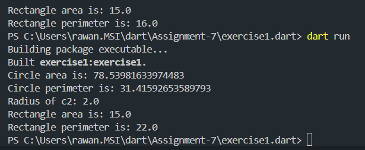

# Dart OOP Exercises

## Exercise 1

### Instructions
1. Create abstract class `Shape` with `getArea` and `getPerimeter` methods.
2. Implement `Circle` and `Rectangle` classes extending `Shape`.
3. Implement constructors, methods, and getters/setters as described.

### Running the Exercise
1. Ensure Dart SDK is installed.
2. Run the following command to execute `exercise1.dart`:
    ```sh
    dart exercise1.dart
    ```

## Exercise 2

### Instructions
1. Create `Person` class.
2. Implement `Author`, `Book`, and `Customer` classes as described.
3. Add methods to handle books for customers.

### Running the Exercise
1. Ensure Dart SDK is installed.
2. Run the following command to execute `exercise2.dart`:
    ```sh
    dart exercise2.dart
    ```

## Expected Output

### Exercise 1


### Exercise 2


