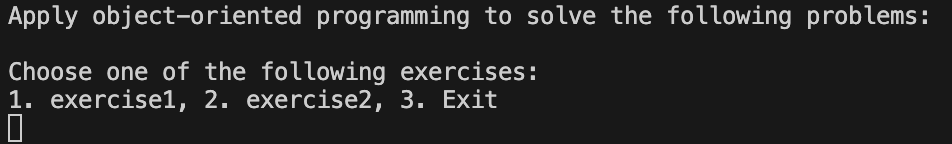
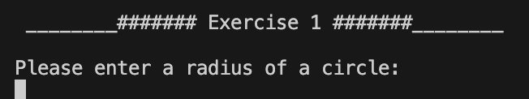
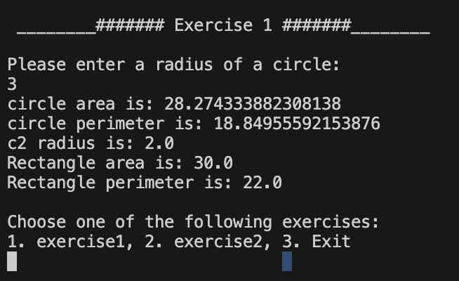
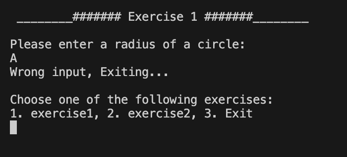
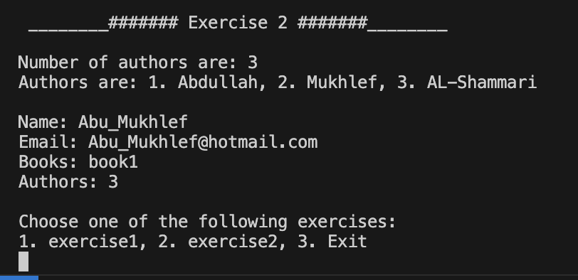

# OOP & Error Handling

### I have used a basic OOP for calculations and error handling
---
# It is imperative to verify that the <!--Links-->[Dart](https://dart.dev/)<!--Links--> language is installed on your machine before proceeding.
---
## Features
1. ###### Calculate the Shape(Circle,Rectangle) Area
3. ###### Calculate the Shape Perimeter
4. ###### Show the relationship between books(objects), customers(objects) and Author, using inheritance

## how to use it
* After installing the Dart language, open the terminal in the project directory and run the command "dart run" to start the program.
___

### Enter numbers

---
### Enter number(3) for example, it will be like this(work correctly)

### out put will be like this

___

### Enter anything(A) for example, it will throw an error. but there is't any error. because I handled the error by using try and catch.

---
### Herr in exercise 2 show the relationship between books(objects), customers(objects) and Author, using inheritance

