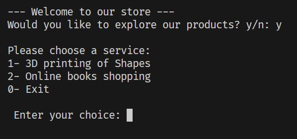
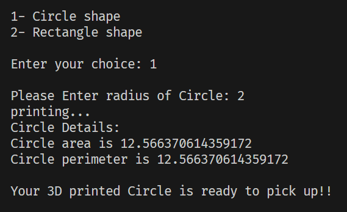
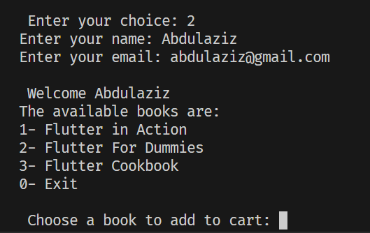
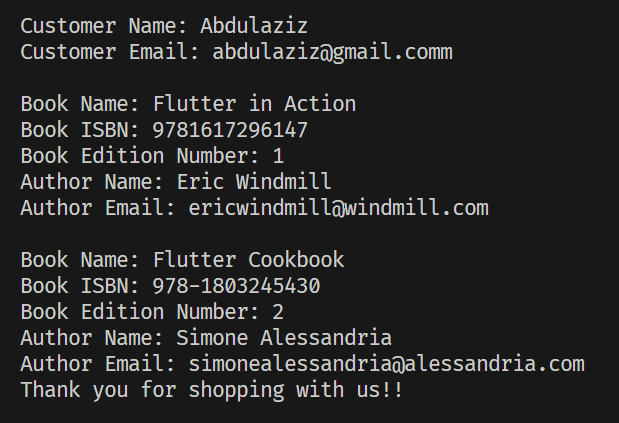

# Simple Store Application
This project provides a command-line interface for two main services: 3D printing of shapes and online book shopping.

### Features

- **Order a 3D shape to be printed (Circle or Rectangle)**

- **View detailed information for books in cart**

- **View the available books in the store and choose to add them to cart**

- **View detailed information about shape ordered to be 3D printed**

# Instructions

- Type 'y' at the start of the program to view menu

- Type anything else to view an example of output of the program.

- Enter 1 to choose Shapes to print
    Circle Or Rectangle

    

- Enter 2 to View books available
    Choose books to add to your cart

    

    Detailed information will be shown

- Enter 0 to Exit

## Future work

- 3D printing custom coffee mugs for customers
- Adding more books to view
- A section for exchanging books with other customers

**Stay Tuned and Thanks for coming!!**

