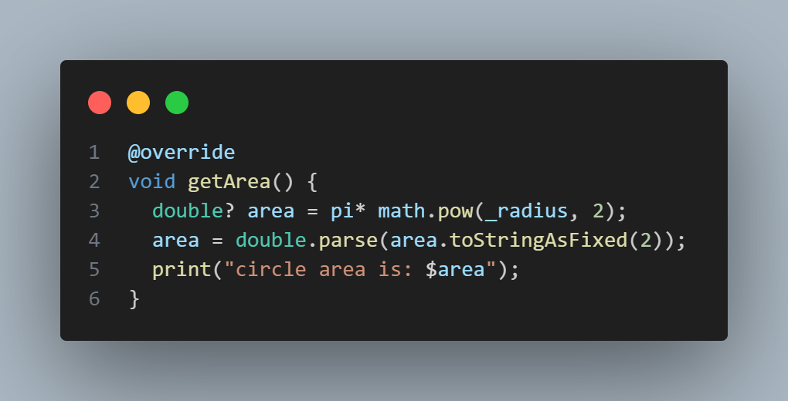
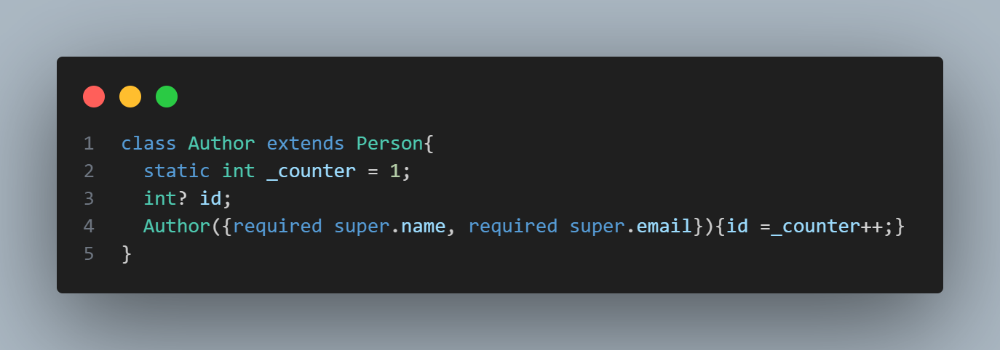

## Project Idea
Tow exercise on object-oriented programming concepts

#### Exercise 1
Create abstract class `Shape` with tow subclasses `Circle` & `Rectangle`
each subclasses have their defult and named Constructer 

the subclasses override tow method `getArea()` & `getPerimeter()` from 
class Shape for calculate area & perimeter

in example `getPerimeter()` method from class Circle :

with more oop concepts search for it :)

#### Exercise 2
create a class `Book` and parent class `Person`
with his subclasses `Author` & `Customer` the idea is
for connect Customer with their book using 
oop concepts sush as object call counter in example :

with more oop concepts search for it :)